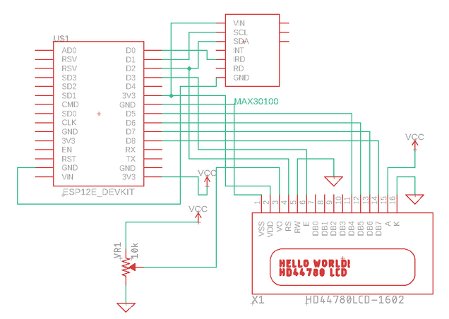
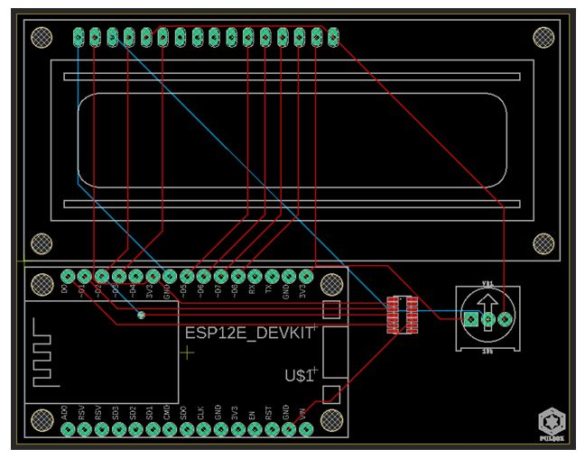
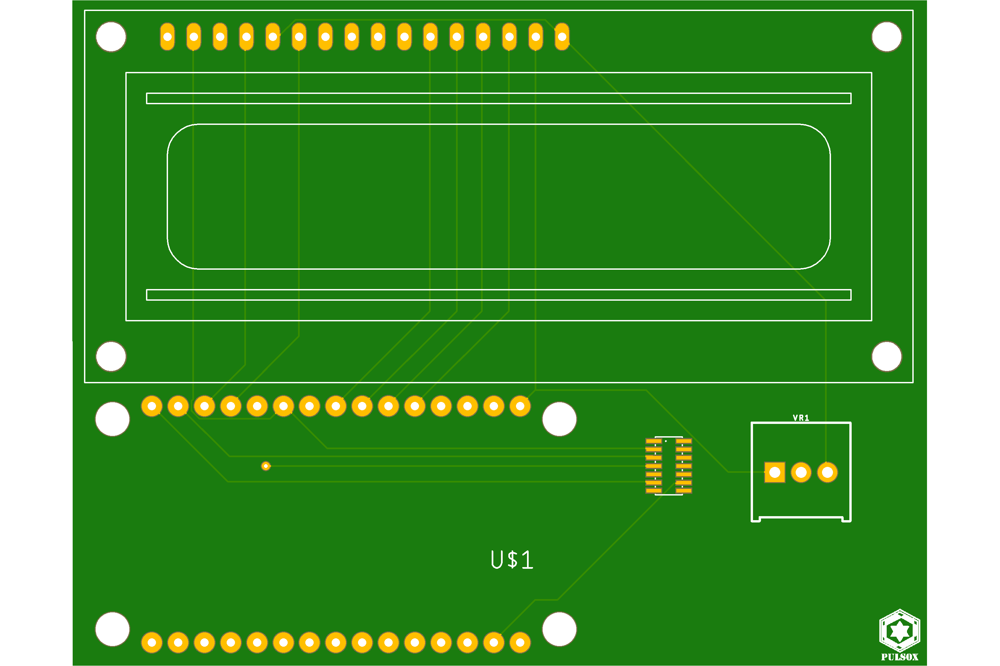

<p align="center">
  
  </p>
<h2>Introduction</h2>

<p> Pulse oximeters are electronic devices capable of measuring blood oxygen concentration levels as well as heart beat rate. Although they originally found their use only in medical institutions, the COVID-19 pandemic led to rise in demand for such devices. Naturally, prices shot up through the roof with people being forced to buy them at 3-4x the prices to save their dear ones' lives. </p>
<p> Pulsox is an IoT based pulse oximeter capable of detecting heart rate as well as oxygen concentration. The data is displayed locally in the LCD display as well as sent to the Blynk IoT platform. This data can be visualized in real-time through an app. 
  </p>
  
  
<p align="center"></p>
  
<h2>Installation</h2>

<p>Following are the steps related to usage and installation:</p>
<ul>
  <li>Once the circuit has been assembled with the <a href="https://github.com/InvincibleJuggernaut/Pulsox#components">components</a> as shown <a href="https://github.com/InvincibleJuggernaut/Pulsox#schematic">here</a>, connect the microcontroller to the PC using a USB cable.</li>
  <li>Clone this repository using</li>
  
```
  git clone https://github.com/InvincibleJuggernaut/Pulsox.git
```
  <li>Open the file <i>pulsox.ino</i> using your preferred IDE and flash it to the microcontroller</li>
  <li>To observe the readings in the Blynk app, you first need to setup an account and paste the credentials along with the wireless network credentials inside the code in <i>pulsox.ino</i>. You could follow this <a href="https://www.electronicslovers.com/2018/06/esp8266-in-combination-with-blynk-app.html">tutorial</a></li>.  
</ul>

<h2>Components</h2>


<ul>
  <li>NodeMCU ESP8266</li>
  <li>MAX30102</li>
  <li>LCD 16x2</li>
  </ul>
  
<h2>Schematic</h2>

<p align="center">

</p>
<p align="center">
  <b>Circuit schematic</b>
  </p>
  
  <br>
  <br>
  
<h2>Layout</h2>

<p align="center">

  </p>
  <p align="center">
  <b>PCB layout for Pulsox</b>
</p>

<br>
<br>

<p align="center">
</p>
<p align="center">
  <b>Real life rendering of PCB</b>
  </p>
  
  <br>
  <br>
  
<p><b>Note:</b> <i> Although the final circuit made use of MAX30102 as the pulse oximetry unit, the circuit schematic as well as the PCB design has been made using another pulse oximentry unit called as MAX30100 since there were no footprint libraries available for MAX30102. However, both the sensors are built by Maxim Integrated having similar functions and may only differ in physical dimensions.</i></p>

<h2>License</h2>

<a href="LICENSE">GPLv3</a>
